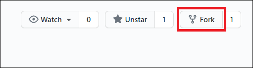
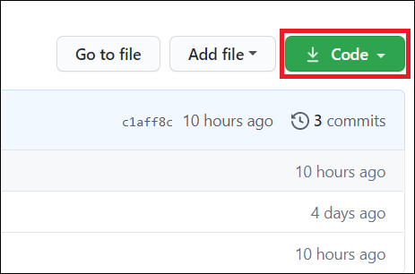
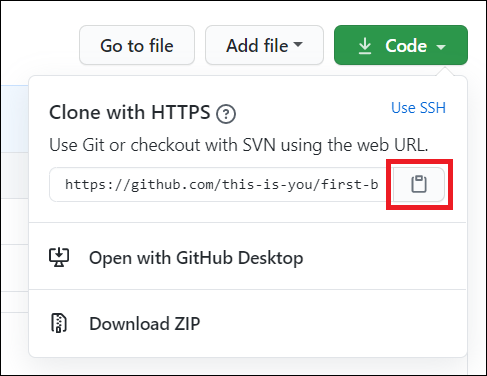
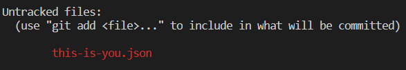
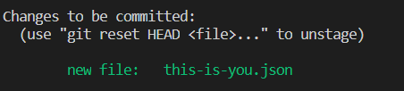
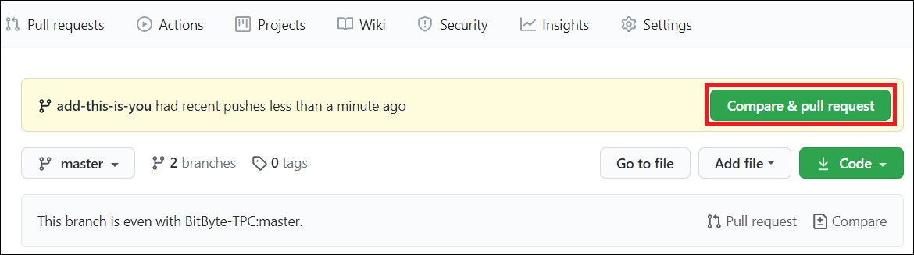
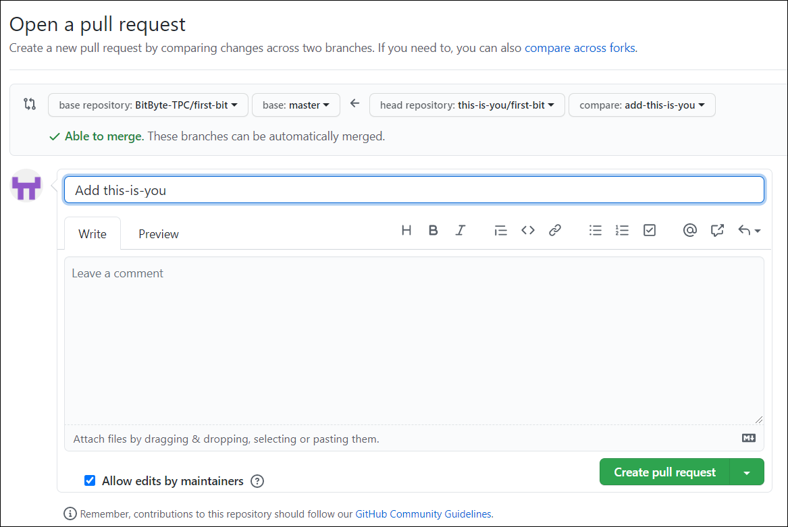

[](https://github.com/firstcontributions/open-source-badges)
[](https://opensource.org/licenses/MIT)


# first-bit

It's hard. It's always hard the first time you do something. Especially when you are collaborating, making mistakes isn't a comfortable thing. We at [BitByte - The Programming Club](https://github.com/BitByte-TPC) wanted to simplify the way new open-source contributors learn & contribute for the first time.

Reading articles & watching tutorials can help, but what's better than actually doing the stuff in a practice environment? So, to provide guidance and simplify the way beginners make their first contribution, we've created this amazing project.

If you are a beginner and wants to get your hands dirty in Open Source, you've hopped on to the right place. This project is made just for you.

## About first-bit

This project is developed and maintained by [BitByte - The Programming Club](https://github.com/BitByte-TPC) to help young developers kickstart their journey to the world of Open Source. This is a very basic project where you can easily make your first contribution and learn the complete workflow of using Git and Github along the way.

So, let's start with the first and the most basic step, installing **Git**.

## Install Git

If you don't have git on your machine, [install it](https://git-scm.com/downloads).

## Configure Git

So by now you must have successfully downloaded and installed Git on your system. Congrats! :tada: You have completed your first and the most basic step into Open Source.

Now, it's time to let Git know who you really are, i.e., provide your Name and Email Address to Git. This step is important because Git attaches your identity with every commit (we'll talk about that later) you make; so that if someone comes around asking, *Hey! Who made these changes?* or *Hey! Who wrote this beautiful code?*, Git can instantly say, oh it was this guy or that lady.

To set your *username* and *email* in Git, open your Terminal (on Linux, press `Ctrl + Alt + t`) or Command Prompt (on Windows, press `Windows + r` to open Run box, type `cmd` there and hit `Enter`) and type the following comands:

```
git config --global user.name "your-full-name"
git config --global user.email "your-email@domain.com"
```

replacing `your-full-name` with your Full Name and `your-email@domain.com` with your email address (associated with your GitHub Account).

Done that? Well congrats again!! :tada: Now, you're all set to start using Git on your system and make wonderful Open Source contributions. :raised_hands:

## Fork this repository

So, you've come this far. That means you're dedicated enough to make your first contribution to this repository. Amazing! :heart_eyes:

So, let's start by forking this repository. But, what exactly is *forking*, you'd ask! Well, as you don't own this repository, you cannot make any changes directly into it. Anyways, it would cause a disaster if anyone could make any changes into it, wouldn't it? Like assume, some notorious person comes and deletes this whole repository! Well what would we do then. restore the repository you'd say but why should we go through all this trouble? :information_desk_person:



So, how would you make changes to this repository then? Well, that's where forking comes in. Forking this repository will create an exact copy of this repository in your account. And guess what, you can make any changes in that copy and send a Pull Request (we'll talk about that later) to us when you're done with making changes asking us to merge those changes into our main repository. Isn't that amazing? :grinning:

So, what are your waiting for? Go ahead and Fork this repository by clicking on the fork button on the top of this page.

## Clone the repository



Now clone the forked repository to your machine. Go to your GitHub account, open the forked repository, click on the clone button and then click the *copy to clipboard* icon.

Open a terminal and run the following git command:

```
git clone "url you just copied"
```
where "url you just copied" (without the quotation marks) is the url to this repository (your fork of this project). See the previous steps to obtain the url.



For example:
```
git clone https://github.com/this-is-you/first-bit.git
```
where `this-is-you` is your GitHub username. Here you're copying the contents of the first-bit repository on GitHub to your computer.

## Create a branch

Change to the repository directory on your computer (if you are not already there):

```
cd first-bit
```
Now create a branch using the `git checkout` command:
```
git checkout -b <add-your-new-branch-name>
```

For example:
```
git checkout -b add-alonzo-church
```
(The name of the branch does not need to have the word *add* in it, but it's a reasonable thing to include because the purpose of this branch is to add your name to a list.)

## Make necessary changes

### For Linux Users

- On your terminal, change directory (`cd`) to `public/directory`  (it's where you'll need to add a new file).

  ```
  cd public/directory
  ```

- Copy the template (`name.json.example`) in a new file with name `this-is-you.json` where `this-is-you` is your GitHub username.

  ```bash
  cp name.json.example this-is-you.json
  ```
  (Don't forget to replace `this-is-you` with your username above)

- Open your newly created file in `gedit` editor to make necessary changes.

  ```bash
  gedit this-is-you.json
  ```

- In the file, replace `this-is-you` with your GitHub username, `your-name` with your Full Name and update the text in bio.
- Save the file by pressing `Ctrl + s` and then close the editor.

Congrats! :raised_hands: You've now made all the necessary changes required for you to contribute to this repository and get yourself featured on the [first-bit](https://bitbyte-tpc.github.io/first-bit/) website :tada: :tada:. Now, hop on to [Commit your changes](#commit-your-changes) section to create a new version of this repository out of the changes made by you (isn't that amazing :heart_eyes:) and then make those changes live.

### For Windows Users

#### Using Terminal

- On your command prompt (cmd), change directory (`cd`) to `public/directory` (it's where you'll need to add a new file).

  ```
  cd public/directory
  ```

- Now, type `notepad this-is-you.json` in your command prompt (replace `this-is-you` with your GitHub username) and hit `Enter`. This will search for a file with name `this-is-you.json` in your current directory.
- If a file with the same name exists in your current directory (which will not be the case unless you create one), it will be opened using notepad.
- If not (which is our case :wink:), Windows will display a prompt saying `Do you want to create a new file?`.
- On clicking `Yes`, a file with name `this-is-you.json` will be created in your current directory :tada: and opened using notepad.
- Now copy the follwing text and paste it in your newly created file:
  ```
    {
        "githubId": "this-is-you",
        "name": "your-name",
        "bio": "Something about yourself using not more than 64 characters." 
    }
  ```
  replacing `this-is-you` with your GitHub username, `your-name` with your Full Name and updating the text in bio.

  **For example:**
  ```
    {
        "githubId": "sdhiman99",
        "name": "Shivansh Dhiman",
        "bio": "Searching new horizons.."
    }
  ```
- Save the file by pressing `Ctrl + s` and close the notepad.

Congrats! :raised_hands: You've now made all the necessary changes required for you to contribute to this repository and get yourself featured on the [first-bit](https://bitbyte-tpc.github.io/first-bit/) website :tada: :tada:. Now, hop on to [Commit your changes](#commit-your-changes) section to create a new version of this repository out of the changes made by you (isn't that amazing :heart_eyes:) and then make those changes live.

#### Using GUI

- Open your file explorer and navigate to the directory where you cloned your forked repository.
  (You can check the address where you cloned the repository by typing `pwd` in your command prompt).
- Navigate to `public/directory` from there.
- Create a new file with name `<this-is-you>.json` where `this-is-you` is your GitHub username and `json` is the file extension.
- Open `name.json.example` file using your favourite text editor, copy its content and then close it.
- Open the newly created file using your favourite text editor and paste the content you just copied.
- Replace `this-is-you` with your GitHub username, `your-name` with your Full Name and update the text in bio in the content you just pasted.
- Save the file by pressing `Ctrl + s` and close the text editor.

Congrats! :raised_hands: You've now made all the necessary changes required for you to contribute to this repository and get yourself featured on the [first-bit](https://bitbyte-tpc.github.io/first-bit/) website :tada: :tada:.

One last thing you need to do before moving on to the next step is to change directory (`cd`) to `public/directory` on your command prompt, where you've just created your new file.

```
cd public/directory
```

Now, hop on to [Commit your changes](#commit-your-changes) section to create a new version of this repository out of the changes made by you (isn't that amazing :heart_eyes:) and then make those changes live.

## Commit your changes



If you go to the project directory and execute the command `git status`, you'll see there are changes.

Add those changes to the branch you just created using the `git add` command:

```
git add this-is-you.json
```



Execute `git status` again to check that your changes are ready to be committed.

Now commit those changes using the `git commit` command:
```
git commit -m "Add this-is-you.json"
```

## Push changes to GitHub

Push your changes using the command `git push`:
```
git push origin <add-your-branch-name>
```
replacing `<add-your-branch-name>` with the name of the branch you created earlier.

## Submit your changes for review

If you go to your repository on GitHub, you'll see a  `Compare & pull request` button. Click on that button.



Now submit the pull request.



Soon I'll be merging all your changes into the master branch of this project. You will get a notification email once the changes have been merged.

## Where to go from here?

Congrats!  You just completed the standard _fork -> clone -> edit -> PR_ workflow that you'll encounter often as a contributor!

Celebrate your contribution and share it with your friends and followers by going to [web app](https://firstcontributions.github.io/#social-share).

You could join our slack team in case you need any help or have any questions. [Join slack team](https://join.slack.com/t/firstcontributors/shared_invite/enQtNjkxNzQwNzA2MTMwLTVhMWJjNjg2ODRlNWZhNjIzYjgwNDIyZWYwZjhjYTQ4OTBjMWM0MmFhZDUxNzBiYzczMGNiYzcxNjkzZDZlMDM).

Now let's get you started with contributing to other projects. We've compiled a list of projects with easy issues you can get started on. Check out [the list of projects in the web app](https://firstcontributions.github.io/#project-list).

